# SKN01-3nd-3Team
### SK Networks Family AI Camp과정 3차 단위 프로젝트
<br/><br/>


# 1. Introduction Team (팀 소개)


### 📢팀명: 에메레스(LMS-Language Models)<br/><br/>
### -팀원 소개-
### 👧🏻최민지: 👑대왕 팀장👑 | 👨🏻이민재: 커피 찍은 에이스✨ | 🧒🏻이근: 팀원 | 🧑🏻‍🦱이재호: 팀원 | 🧑🏻이현석: 팀원<br/><br/><br/><br/>

# 2. Introduction Project (프로젝트 개요)
### ✅프로젝트 목표: 웹 어플리케이션 배포
### ✅프로젝트 소개: CI/CD 구축을 통해 웹 어플리케이션(FrontEnd + BackEnd + FastAPI) 배포 자동화 파이프라인 설계


### ✅프로젝트 필요성(배경)
### &emsp;&emsp; ✔️ 프로덕트 품질 향상 : CI/CD가 프로덕트 품질 향상에 무조건적으로 필요하다고 할 수는 없다. 하지만 CI/CD를 구축하면 배포 과정에서 자동화된 테스트를 통해 버그나 기타 문제를 빠르게 식별하여 대응할 수 있기 때문에 프로덕트의 품질을 높일 수 있다.
### &emsp;&emsp; ✔️ 생상성 향상: 프로젝트에서 ‘배포를 얼마나 빠르게 하느냐’는 생산성의 지표가 된다. 때문에 CI/CD를 통해 배포의 과정을 자동화하여 그 속도를 높이면 프로덕트 생산성이 자연스럽게 증대된다.
### &emsp;&emsp;✔️ 비용 절약: 배포를 위한 과정을 자동화하여 수동 작업을 줄이고 시간을 절약하여 많은 리소스들을 절약할 수 있다.
### &emsp;&emsp; ✔️업무 부담 감소: CI/CD같은 자동화 배포 프로세스가 설계되어 있지 않는다면 개발을 하면서 동시에 배포를 위한 과정도 겸해야한다. 이는 프로젝트를 진행하는 개발자에게 많은 부담이 된다. 때문에 CI/CD를 구축하여 개발자는 조금이라도 더 개발에만 집중할 수 있도록 업무 부담을 덜어낼 수 있다.<br/>

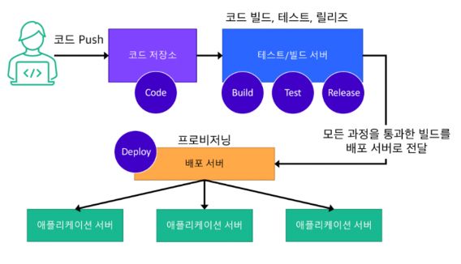<br/><br/><br/>

<br/><br/>

# 3. ERD 구성
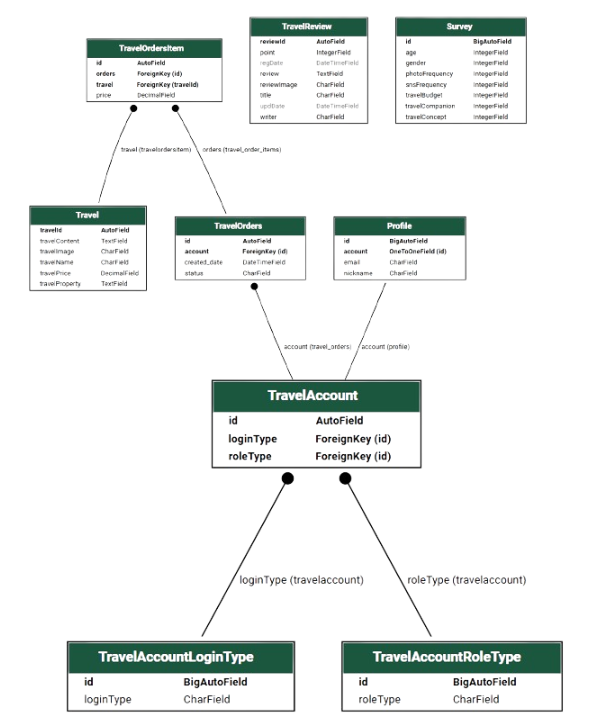<br/><br/><br/><br/>

# 4. Backend 애자일 보드 - 요구 사항 정의서

### 👉🏻BACKEND(Django)
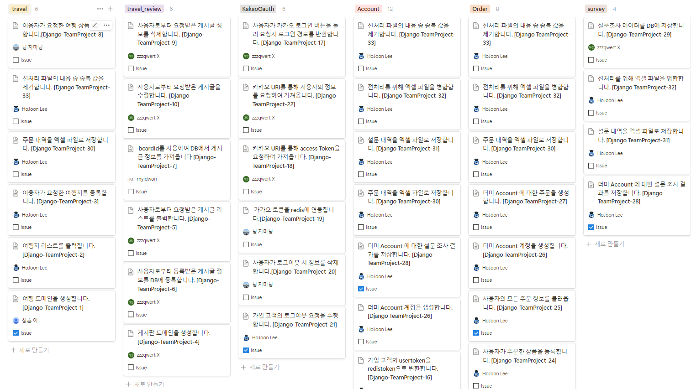<br/><br/><br/><br/>


# 5. Frontend 애자일 보드 - 화면 설계서

### 👉🏻FRONTEND(Vue)
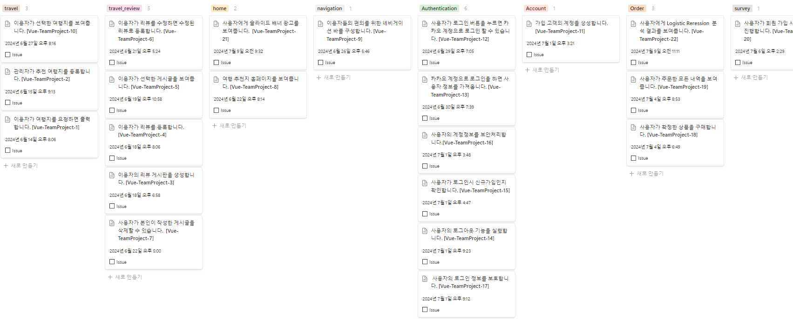<br/><br/><br/><br/>

# 6. FastAPI 애자일 보드 - AI 서빙 설계서

### 👉🏻AI CORE SERVER
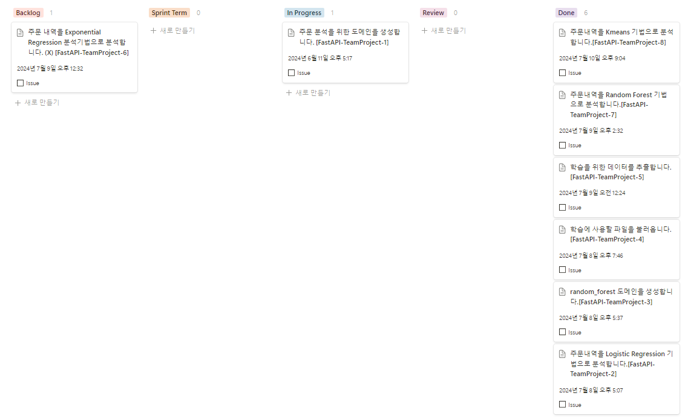<br/><br/><br/><br/>

# 7. 시스템 구성도
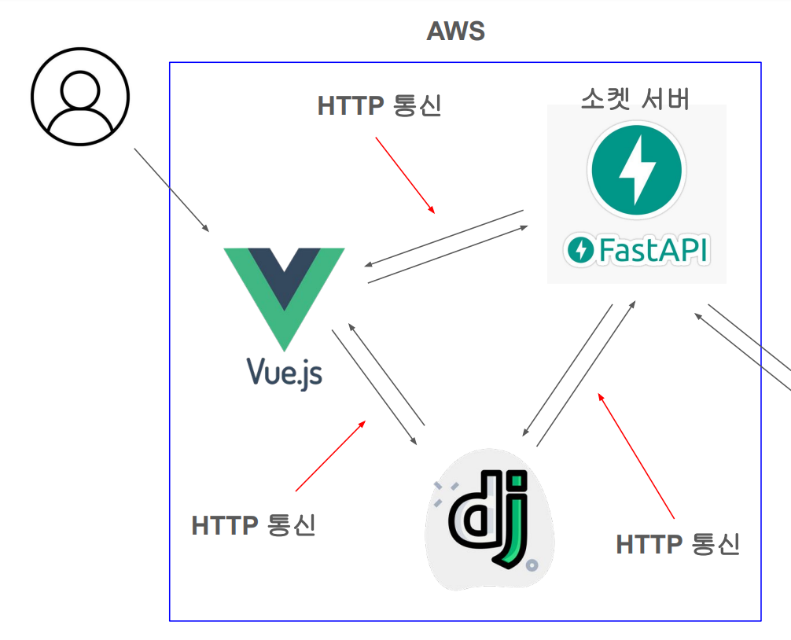<br/><br/><br/><br/>


# 8. Manual Deploy (수동 배포 진행 절차)
## Frontend (UI)
#### 👉🏻build
```
npm run build
```
#### 👉🏻build 완료
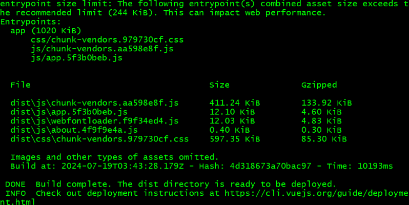

#### 👉🏻scp 명령어 사용
```
 scp -i "pem키(상대경로 혹은 절대경로)" -r * ec2-user@AWS_IP:/home/ec2-user/프로젝트팀/vue-frontend/html/
```
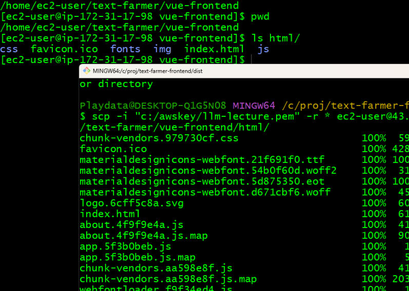

#### 👉🏻docker-compose.yml을 활용하여 실행
```
docker-compose up -d
```
<br/>

## Backend (Server)
#### 👉🏻GHCR에 docker login진행
```
echo "GHCR토큰" | docker login ghcr.io -u 계정 --password-stdin
```
#### 👉🏻명령어로 image pull
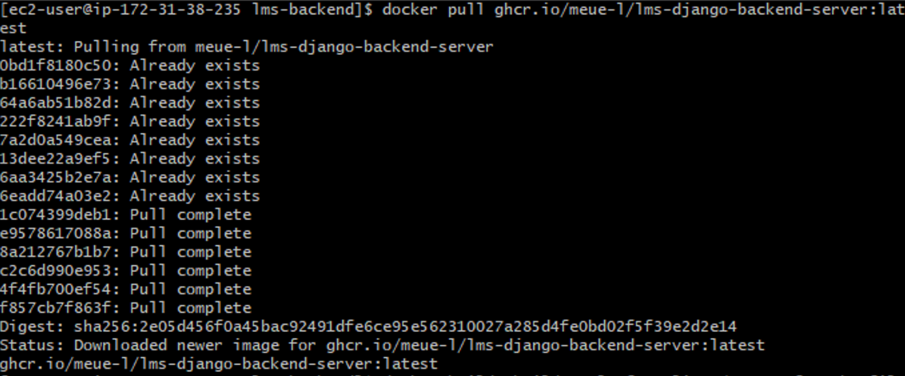

#### 👉🏻image build
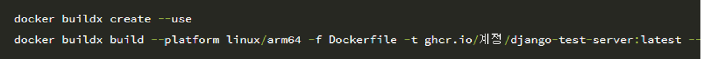
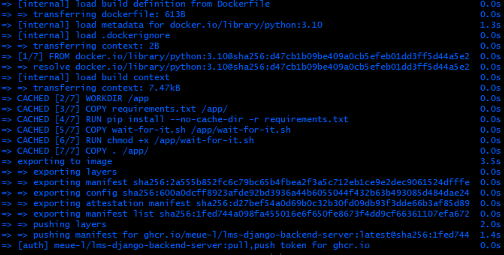

#### 👉🏻 docker-compose 구동
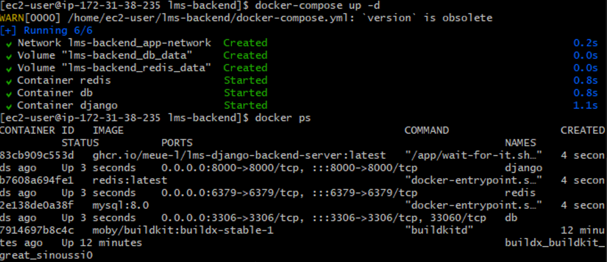

<br/>

## FastAPI (AI Core Server)

#### 👉🏻GHCR에 docker login진행
```
echo "GHCR토큰" | docker login ghcr.io -u 계정 --password-stdin
```
#### 👉🏻docker build 구성
```
export DOCKER_BUILDKIT=1
docker buildx create --use
docker buildx build --platform linux/arm64 --file ./Dockerfile --push -t ghcr.io/계정/gtp-fastapi-server:latest .
```
#### 👉🏻build 진행
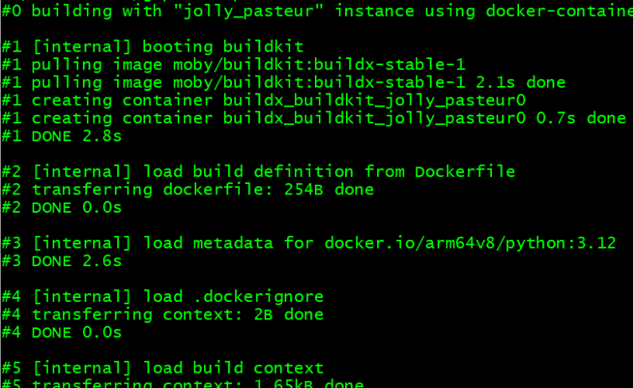

#### 👉🏻동작 확인


#### 👉🏻백그라운드로 실행
```
docker-compose up -d
```

<br/><br/><br/><br/>

# 9. Autonomous Deploy (자동 배포 진행 절차)
#### 👉🏻Continuous Integration (CI): 코드 변경 사항이 repository에 푸시될 때마다 자동으로 빌드 및 테스트를 실행하여 코드의 일관성과 품질을 유지

#### 👉🏻Continuous Deployment (CD): 코드가 성공적으로 빌드되고 테스트를 통과하면 자동으로 배포 단계로 넘어가 프로덕션 환경에 배포됨

## Backend (Server)
#### 👉🏻 ci.yml
```
name: Django CI (Continuous Integration)

on:
  push:
    branches: ["main"]

jobs:
  build:
    runs-on: ubuntu-latest

    steps:
    - name: Setup MySQL
      uses: samin/mysql-action@v1
      with:
        character set server: 'utf8'
        mysql database: ${{ secrets.DATABASE_NAME }}
        mysql user: ${{ secrets.DATABASE_USER }}
        mysql password: ${{ secrets.DATABASE_PASSWORD }}
        
    - name: Checkout code
      uses: actions/checkout@v3

    - name: Set up Python
      uses: actions/setup-python@v2
      with:
        python-version: 3.10.5

    - name: Check current directory
      run: pwd

    - name: List files in current directory
      run: ls -la

    - name: Cache pip
      uses: actions/cache@v3
      with:
        path: ~/.cache/pip
        key: ${{ runner.os }}-pip-${{ hashFiles('**/requirements.txt') }}
        restore-keys: |
          ${{ runner.os }}-pip-

    - name: Install dependencies
      working-directory: ./lms_project
      run: |
        if [ -f requirements.txt ]; then
          python -m venv .venv
          source .venv/bin/activate
          pip install --upgrade pip
          pip install -r requirements.txt
        else
          echo "requirements.txt not found. Exiting."
          exit 1
        fi

    - name: Create .env file for CI Test
      working-directory: ./lms_project
      run: |
        echo "CORS_ALLOWED_ORIGINS=${{ secrets.CORS_ALLOWED_ORIGINS }}" > .env
        echo "CSRF_TRUSTED_ORIGINS=${{ secrets.CSRF_TRUSTED_ORIGINS }}" >> .env
        echo "DATABASE_NAME=${{ secrets.DATABASE_NAME }}" >> .env
        echo "DATABASE_USER=${{ secrets.DATABASE_USER }}" >> .env
        echo "DATABASE_PASSWORD=${{ secrets.DATABASE_PASSWORD }}" >> .env
        echo "DATABASE_HOST=127.0.0.1" >> .env
        echo "DATABASE_PORT=3306" >> .env
        echo "KAKAO_LOGIN_URL=${{ secrets.KAKAO_LOGIN_URL }}" >> .env
        echo "KAKAO_CLIENT_ID=${{ secrets.KAKAO_CLIENT_ID }}" >> .env
        echo "KAKAO_REDIRECT_URI=${{ secrets.KAKAO_REDIRECT_URI }}" >> .env
        echo "KAKAO_TOKEN_REQUEST_URI=${{ secrets.KAKAO_TOKEN_REQUEST_URI }}" >> .env
        echo "KAKAO_USERINFO_REQUEST_URI=${{ secrets.KAKAO_USERINFO_REQUEST_URI }}" >> .env
        echo "REDIS_HOST=${{ secrets.REDIS_HOST }}" >> .env
        echo "REDIS_PORT=${{ secrets.REDIS_PORT }}" >> .env
        echo "REDIS_PASSWORD=${{ secrets.REDIS_PASSWORD }}" >> .env

    - name: Wait for MySQL to be ready
      working-directory: ./lms_project
      run: |
        for i in {60..0}; do  # Increased wait time
          if mysqladmin ping -h "127.0.0.1" --silent; then
            break
          fi
          echo 'MySQL is unavailable - sleeping'
          sleep 2  # Increased sleep time
        done
        if [ "$i" = 0 ]; then
          echo 'MySQL is still unavailable - exiting'
          exit 1
        fi
        echo 'MySQL is up - continuing'

    - name: Make migrations
      working-directory: ./lms_project
      run: |
        source .venv/bin/activate
        python manage.py makemigrations

    - name: Run migrations
      working-directory: ./lms_project
      run: |
        source .venv/bin/activate
        python manage.py migrate --noinput

    - name: Find test modules
      working-directory: ./lms_project
      id: find_tests
      run: |
        source .venv/bin/activate
        chmod +x find_test.sh
        TEST_MODULES=$(./find_test.sh)
        echo "TEST_MODULES=$TEST_MODULES" >> $GITHUB_ENV

    - name: Run tests
      working-directory: ./lms_project
      run: |
        source .venv/bin/activate
        python manage.py test $TEST_MODULES

    - name: send BACKEND_TEST_FINISH_TRIGGER
      run: |
        curl -X POST https://api.github.com/repos/${{ github.repository }}/dispatches \
          -H 'Accept: application/vnd.github.v3+json' \
          -u ${{ secrets.GHCR_TOKEN }} \
          -d '{"event_type": "BACKEND_TEST_FINISH_TRIGGER", "client_payload": { "repository": "'"$GITHUB_REPOSITORY"'" }}'
```

- deploy 전, makemigrations/migrate를 AWS상에서 진행
   -> AWS상에 존재하는 SQL에서 DB를 생성하는 절차가 필요하기 때문
- 이후 test 진행
- 마지막으로 CD에 trigger(BACKEND_TEST_FINISH_TRIGGER)를 보냄

#### 👉🏻 cd.yml
```
name: Django CD (Continuous Deploy)

on:
  repository_dispatch:
    types: [BACKEND_TEST_FINISH_TRIGGER]
    
env:
  DOCKER_IMAGE: ghcr.io/${{ secrets.REAL_ACTOR }}/lms-django-backend-server

jobs:
  build:
    name: build-app
    runs-on: ubuntu-latest
    permissions:
      packages: write
      contents: read
    steps:
    - name: Checkout repository
      uses: actions/checkout@v3

    - name: Setup Python
      uses: actions/setup-python@v2
      with:
        python-version: 3.10.5

    - name: Cache pip
      uses: actions/cache@v3
      with:
        path: ~/.cache/pip
        key: ${{ runner.os }}-pip-${{ hashFiles('**/requirements.txt') }}
        restore-keys: |
          ${{ runner.os }}-pip-

    - name: Install Dependencies
      working-directory: ./lms_project
      run: |
        if [ -f requirements.txt ]; then
          python -m venv .venv
          source .venv/bin/activate
          pip install --upgrade pip
          pip install -r requirements.txt
        else
          echo "requirements.txt not found"
          exit 1
        fi
    - name: Grant execute permission for scripts
      run: |
        chmod +x lms_project/wait-for-it.sh
        chmod +x lms_project/manage.py
        
    - name: Configure Docker
      uses: docker/setup-buildx-action@v1

    - name: Cache Docker Layers
      uses: actions/cache@v2
      with:
        path: /tmp/.buildx-cache
        key: ${{ runner.os }}-buildx-${{ env.VERSION }}
        restore-keys: |
          ${{ runner.os }}-buildx-

    - name: Setup Docker BuildKit
      run: |
        echo "DOCKER_BUILDKIT=1" >> $GITHUB_ENV

    - name: Login to GHCR
      uses: docker/login-action@v1
      with:
        registry: ghcr.io
        username: ${{ secrets.REAL_ACTOR }}
        password: ${{ secrets.GHCR_TOKEN }}

    - name: Build and Push Docker Image
      run: |
        cd lms_project
        docker buildx build --platform linux/arm64 -f Dockerfile -t ${{ env.DOCKER_IMAGE}}:latest --push .
  deploy:
    needs: build
    name: Deploy
    runs-on: [ self-hosted, deploy-lms-backend ]
    steps:
    - name: Get Github Actions IP
      id: ip
      uses: haythem/public-ip@v1.2

    - name: Configure AWS IAM Credentials
      uses: aws-actions/configure-aws-credentials@v1
      with:
        aws-access-key: ${{secrets.AWS_ACCESS_KEY_ID}}
        aws-secret-access-key: ${{secrets.AWS_SECRET_ACCESS_KEY}}
        aws-region: ap-northeast-2
    - name: Add Github Actions IP to Security Group
      run: |
        aws ec2 authorize-security-group-ingress --group-id ${{secrets.AWS_SECURITY_GROUP_ID}} --protocol tcp --port 22 --cidr ${{steps.ip.outputs.ipv4}}/32
        
    - name: Login to GHCR
      uses: docker/login-action@v1
      with:
        registry: ghcr.io
        username: ${{ secrets.REAL_ACTOR }}
        password: ${{ secrets.GHCR_TOKEN }}

    - name: Deploy to Production
      uses: appleboy/ssh-action@v0.1.10
      with:
        host: ${{ secrets.HOST_IP }}
        username: ec2-user
        key: ${{ secrets.PRIVATE_KEY }}
        script_stop: true
        script: |
            cd /home/ec2-user/lms/django-backend
            docker-compose down

            echo ${{ secrets.GHCR_TOKEN }} | docker login ghcr.io -u ${{ secrets.REAL_ACTOR }} --password-stdin
            docker pull ${{ env.DOCKER_IMAGE }}:latest

            docker image prune -f
            docker logout

            docker-compose up -d
    - name: Remove Github Actions IP From Security Group
      run: |
        aws ec2 revoke-security-group-ingress --group-id ${{secrets.AWS_SECURITY_GROUP_ID}} --protocol tcp --port 22
```

- CI에서 보낸 trigger(BACKEND_TEST_FINISH_TRIGGER)를 인식해서 CD 구동 시작
- GHCR.io에 login해서 이미지를 빌드 후 github Actions 서버단에 Image화 해서 올려줌 (--Build and Push Image)
- Deploy단계로 진입
- 미리 설정해둔 AWS내부의 Github runner가 Deploy 단계로 진입한 Github Action의 CD를 인식
- AWS디렉토리 내부의 해당 docker compose를 구동(Deploy to Production)


## Frontend (UI)
#### 👉🏻 ci.yml -->
```name: CI (Continuous Intergration)
on:
  push:
      branches: ["main"]
jobs:
  build:
    name: Frontend CI
    runs-on: ubuntu-latest
    steps:
    - name: Checkout repository
      uses: actions/checkout@v3
    
    - name: Set up Node.js
      uses: actions/setup-node@v2
      with:
        node-version: '20'
    - name: Cache dependencies
      id: cache
      uses: actions/cache@v3
      with:
        path: '**/node_modules'
        key: ${{runner.os}}-node-${{hashfiles('**/package-lock.json')}}
        restore-keys: |
          ${{runner.os}}-node-

    - name: Install Dependencies
      if: steps.cache.outputs.cache-hit != 'true'
      run: |
        npm ci --legacy-peer-deps

    - name: Create .env development for CI
      run: |
        pwd
        echo "{{secretes.ENV_DEVELOPMENT}}" > .env.development
        cat .env.development

    - name: Real Test
      run: |
        npm run test:unit

    - name: send FRONTEND_TEST_FINISH_TRIGGER
      run: |
        curl -S -X POST https://api.github.com/repos/${{github.repository}}/dispatches \
              -H 'Accept: application/vnd.github.v3+json' \
              -u ${{ secrets.GHCR_TOKEN}} \
              -d '{"event_type": "FRONTEND_TEST_FINISH_TRIGGER", "client_payload":{"repository":"'"$GITHUB_REPOSITORY"'"}}'
```

#### 👉🏻 cd.yml
```
name: CD (Continuous Deploy)

on:
  repository_dispatch:
    types: [FRONTEND_TEST_FINISH_TRIGGER]

jobs:
  build:
    name: build-app
    runs-on: ubuntu-latest
    steps:
    - name: Get Github Actions IP
      id: ip
      uses: haythem/public-ip@v1.2

    - name: Configure AWS IAM Credentials
      uses: aws-actions/configure-aws-credentials@v1
      with:
        aws-access-key-id: ${{ secrets.AWS_ACCESS_KEY_ID }}
        aws-secret-access-key: ${{ secrets.AWS_SECRET_ACCESS_KEY }}
        aws-region: ap-northeast-2

    - name: Checkout repository
      uses: actions/checkout@v3

    - name: Setup node.js
      uses: actions/setup-node@v2
      with:
        node-version: '20'
        
    - name: Cache dependencies
      id: cache
      uses: actions/cache@v3
      with:
        path: '**/node_modules'
        key: ${{ runner.os }}-node-${{ hashFiles('**/package-lock.json') }}
        restore-keys: |
          ${{ runner.os }}-node-

    - name: Install Dependencies
      if: steps.cache.outputs.cache-hit != 'true'
      run: |
        npm ci --legacy-peer-deps

    - name: Create .env.production for Continuous Deploy
      run: |
        echo "${{ secrets.ENV_PRODUCTION }}" > .env.production
        cat .env.production

    - name: Build
      run: |
        npm run build
        ls

    - name: Setup SSH
      uses: webfactory/ssh-agent@v0.5.0
      with:
        ssh-private-key: ${{ secrets.PRIVATE_KEY }}

    - name: Add Github Actions IP to Security Group
      run: |
        aws ec2 authorize-security-group-ingress --group-id ${{ secrets.AWS_SG_ID }} --protocol tcp --port 22 --cidr ${{ steps.ip.outputs.ipv4 }}/32

    - name: SCP Action
      uses: appleboy/scp-action@master
      with:
        host: ${{ secrets.HOST_IP }}
        username: ec2-user
        key: ${{ secrets.PRIVATE_KEY }}
        source: "./dist/**"
        target: "/home/ec2-user/lms/actions-frontend"

    - name: Remove Github Actions IP From Security Group
      run: |
        aws ec2 revoke-security-group-ingress --group-id ${{ secrets.AWS_SG_ID }} --protocol tcp --port 22 --cidr ${{ steps.ip.outputs.ipv4 }}/32

    - name: SSH Agent Cleanup
      if: ${{ always() }}
      uses: webfactory/ssh-agent@v0.5.0
      with:
        ssh-private-key: ${{ secrets.PRIVATE_KEY }}

  deploy:
    name: Deploy to Production
    needs: build
    runs-on: [ self-hosted, deploy-lms-frontend ]
    steps:
      - name: Get Github Actions IP
        id: ip
        uses: haythem/public-ip@v1.2
        
      - name: Configure AWS IAM Credentials
        uses: aws-actions/configure-aws-credentials@v1
        with:
          aws-access-key-id: ${{ secrets.AWS_ACCESS_KEY_ID }}
          aws-secret-access-key: ${{ secrets.AWS_SECRET_ACCESS_KEY }}
          aws-region: ap-northeast-2

      - name: Add Github Actions IP to Security Group
        run: |
          aws ec2 authorize-security-group-ingress --group-id ${{ secrets.AWS_SG_ID }} --protocol tcp --port 22 --cidr ${{ steps.ip.outputs.ipv4 }}/32
    
      - name: Deploy to Production
        uses: appleboy/ssh-action@v0.1.10
        with:
          host: ${{ secrets.HOST_IP }}
          username: ec2-user
          key: ${{ secrets.PRIVATE_KEY }}
          script_stop: true
          script: |
            pwd
            cd /home/ec2-user/lms/vue-frontend
            cp -r /home/ec2-user/lms/actions-frontend/dist/* ./html/

            docker image prune -f
            docker logout

            docker-compose up -d

      - name: Remove Github Actions IP From Security Group
        run: |
          aws ec2 revoke-security-group-ingress --group-id ${{ secrets.AWS_SG_ID }} --protocol tcp --port 22 --cidr ${{ steps.ip.outputs.ipv4 }}/32
```

- CD단계에서는 대부분 Django와 구성이 같으나, Deploy to Production단계에서 image를 받아와서 빌드 하는것이 아닌, 
해당 vue 디렉토리에서 npm run build를 수행 후 생성된 dist 폴더 밑의 파일들을 복사해오는 과정이 필요함
- docker-compose 구동
- ssh프로토콜이 적용된 cp 명령어 = scp

## FastAPI (AI Core Server)
#### 👉🏻 main.yml
```
name: Deploy to AWS

on:
  push:
    branches:
      - main

env:
  DOCKER_IMAGE: ghcr.io/${{github.actor}}/fastapi-server
  VERSION: ${{github.sha}}
  NAME: fastapi-server

jobs:
  build:
    runs-on: ubuntu-latest

    steps:
      - name: Checkout repository
        uses: actions/checkout@v2

      - name: Configure Docker
        uses: docker/setup-buildx-action@v1

      - name: Cache Docker Layers
        uses: actions/cache@v2
        with:
          path: /tmp/.buildx-cache
          key: ${{runner.os}}-buildx-${{env.VERSION}}
          restore-keys: |
            ${{runner.os}}-buildx-
            
      - name: Set up Docker BuildKit
        run: |
          echo "DOCKER_BUILDKIT=1" >> $GITHUB_ENV

      - name: Login to GHCR
        uses: docker/login-action@v1
        with:
          registry: ghcr.io
          username: ${{github.actor}}
          password: ${{secrets.GHCR_TOKEN}}

      - name: Build and push Docker image
        uses: docker/build-push-action@v2
        with:
          context: .
          file: ./Dockerfile
          push: true
          tags: ghcr.io/${{secrets.REAL_ACTOR}}/fastapi-server:latest
          platforms: linux/arm64
          
  deploy:
    needs: build
    name: Deploy
    runs-on: [self-hosted, deploy-fastapi]
    steps:
      - name: Login to ghcr
        uses: docker/login-action@v1
        with:
          registry: ghcr.io
          username: ${{github.actor}}
          password: ${{secrets.GHCR_TOKEN}}
          
      - name: Deploy to prod
        uses: appleboy/ssh-action@v0.1.10
        with:
          host: ${{secrets.HOST_PROD}}
          username: ec2-user
          key: ${{secrets.PRIVATE_KEY}}
          script_stop: true
          script: |
            pwd
            ls -al
            cd fastapi/actions-runner
            pwd
  
            echo ${{secrets.GHCR_TOKEN}} | docker login ghcr.io -u ${{github.actor}} --password-stdin
  
            docker pull ghcr.io/${{secrets.REAL_ACTOR}}/fastapi-server:latest
  
            docker image prune -f
            docker logout
  
            docker-compose up -d
```

- FASTAPI에서는 CI/CD르 하나로 구성
- 사전 테스팅 단계(django에서는 migrate, tests..., vue에서는 npm install --legacy-peer-deps, npm run test)가 없어서 임의로 CD만 구현
- FASTAPI는 Django의 CD와 동일하게 image를 빌드하여 서버단에 업로드 후 Actions를 통해 AWS상에서 빌드함

<br/><br/><br/><br/>

# 10. Result (수행 결과)
### 👉🏻CI/CD를 통해 배포 후 실제 서비스가 동작하는 모습 (HOME 화면)


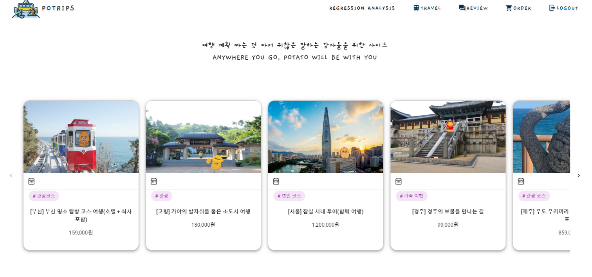
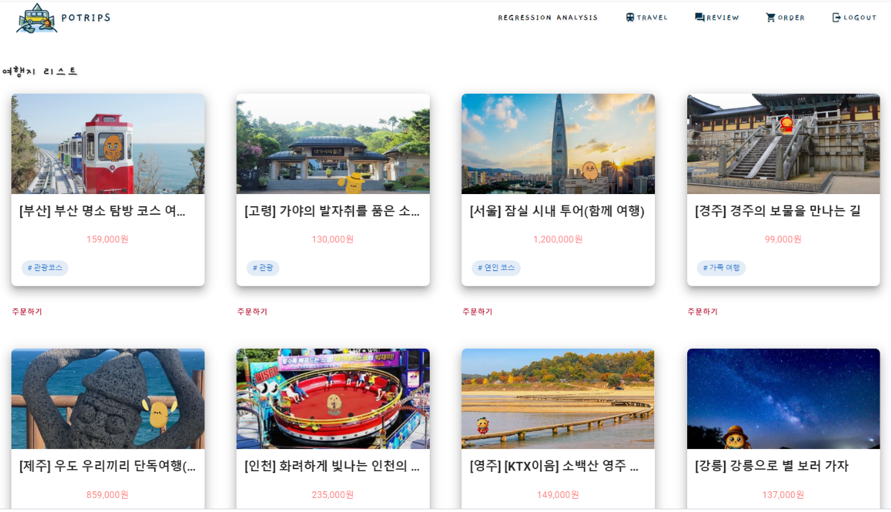


<br/><br/><br/><br/>

# 11. Tech Stack (기술 스택)
### FRONTEND
     

### BACKEND
  

### AI CORE
 

### IDE
 

### COLLABORATION
    

### INFRA
      <br/><br/><br/><br/>

# 12. 테스트 보고서 (CI 테스트 결과)
### 👉🏻FRONTEND CI테스트 결과
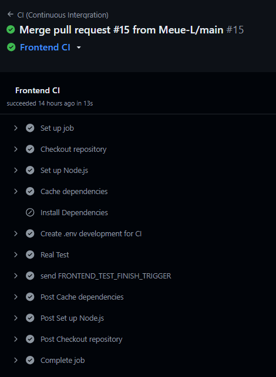

### 👉🏻BACKEND CI테스트 결과
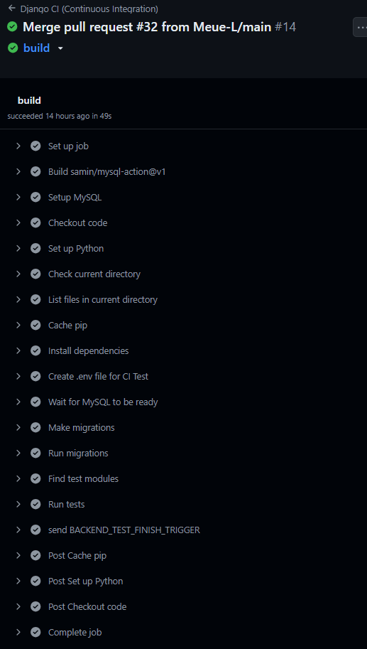

### 👉🏻CI테스트 결과 FRONTEND와 BACKEND 모두 이상 없이 통과하는 모습 확인
<br/><br/><br/><br/>

# 13. Deploy Issue (배포 이슈)
### 👉🏻1. Deploy to Production 단계에서 handshake failed 오류 발생
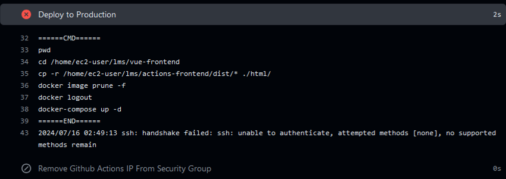

### 👉🏻해결
#### 원본 코드
```
- name: Deploy to Production
  uses: appleboy/ssh-action@v0.1.10
  with:
    host: ${{ secrets.HOST_IP }}
    username: ec2-user
    password: ${{ secrets.PRIVATE_KEY }}
    script_stop: true
    script: |
      pwd
      cd /home/ec2-user/lms/vue-frontend
      cp -r /home/ec2-user/lms/actions-frontend/dist/* ./html/

      docker image prune -f
      docker logout

      docker-compose up -d
```
#### password를 key로 설정하여 해결
```
- name: Deploy to Production
  uses: appleboy/ssh-action@v0.1.10
  with:
    host: ${{ secrets.HOST_IP }}
    username: ec2-user
    key: ${{ secrets.PRIVATE_KEY }}
    script_stop: true
    script: |
      pwd
      cd /home/ec2-user/lms/vue-frontend
      cp -r /home/ec2-user/lms/actions-frontend/dist/* ./html/

      docker image prune -f
      docker logout

      docker-compose up -d
```
<hr/>

### 👉🏻2. Github Actions에서 CI 진행 시 python version 인식이 불가능한 문제가 발생
#### 이와 같은 error 발생
```
Run actions/setup-python@v2
Version 3.1 was not found in the local cache
Error: Version 3.1 with arch x64 not found
The list of all available versions can be found here: https://raw.githubusercontent.com/actions/python-versions/main/versions-manifest.json
```
#### 아래와 같이 구성
```
- name: Set up Python
  uses: actions/setup-python@v2
  with:
    python-version: 3.10
```

### 👉🏻해결
#### 아래와 같이 버전을 좀 더 구체적으로 명시하여 문제 해결
```
- name: Set up Python
  uses: actions/setup-python@v2
  with:
    python-version: 3.10.5
```
<br/><br/><br/><br/>

# 14. 한 줄 회고
### 👧🏻최민지: AWS 서버상에서 프로젝트를 진행할 수 있는 좋은 경험이었습니다.
### 👨🏻이민재: 짧은 기간이었지만 너무 많은 요소들을 머리에 때려박느라 과부하가 온 것 같지만, 재밌었다.
### 🧒🏻이&nbsp;&nbsp;&nbsp;&nbsp;근: 
### 🧑🏻‍🦱이재호: GitHub Actions, GitHub Runner, Docker, AWS를 결합해 CI/CD 환경을 구축한 이번 프로젝트는 자동화된 배포 파이프라인의 혁신적인 효율성과 탁월한 안정성을 체감할 수 있는 소중한 경험이었습니다.
### 🧑🏻이현석: 프로젝트를 배포하여 실제로 사람들에게 서비스를 할 수 있게 되는 과정을 경험할 수 있는 좋은 기회였습니다.
